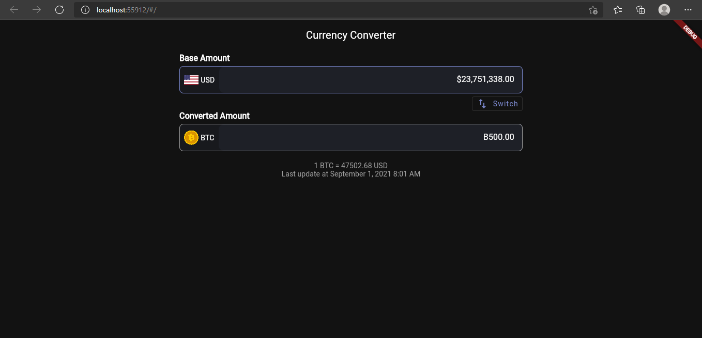
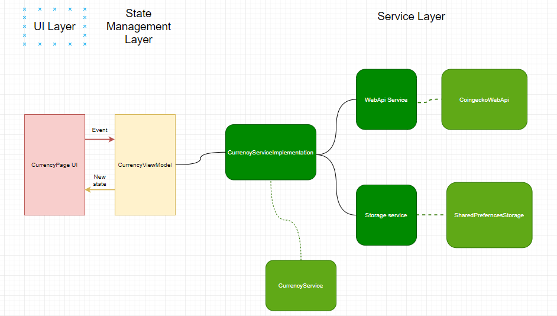

# USD/BTC Converter

URL shorting mobile app using [coingecko](https://www.coingecko.com/en/api/documentation)

## Development Environment

App was developed using `VS Code` , `Flutter 2.2.1` and `Dart 2.13.0`

## Screenshots

Mobile UI                | Web UI
:-----------------------:|:-----------------------
 | 

## Getting Started

After cloning this repository, perform the following steps before building your project.

Get third party packages:

```sh
flutter pub get
```

when you open the project you will see tones of errors due to `AppLocalizations` is not generated yet.
`flutter run` will generate `AppLocalizations` and run the app to your emulator.

## User Requirements

* User shall get the exchange rate with the fetching time.
* User shall enter numeric values only.
* User shall get currency exchange values in real-time.
* User should switch between the base currency and converted currency.
* User should get values in real-time when editing converted amount or base amount.

## System Requirements

* The app shall only accept numerical values.
* The app shall not accept more than 8 decimal places.
* The app should have responsive design.
* The app should support dark and light themes.
* The app should render app theme based on system theme.
* The app shall appropriately formate amounts based on the amount currency.
* The app shall update the amount text fields in real-time if the value changed in one of them.
* The app shall have a max BTC amount user can't exceed.
* The app shall adjust all text fields amount if the user enters a value bigger than max BTC amount.
* The app shall get rates from web API periodically.
* The app shall get rates from the cache if rates are still valid.
* The app shall get rates from the cache even if rates are not valid if they can't reach the web API.
* The app should invalidate the cached rates after it consumes its left time.
* The app shall have a global state.

## Architecture



## Tests

to run all available test cases:

```sh
flutter test
```
